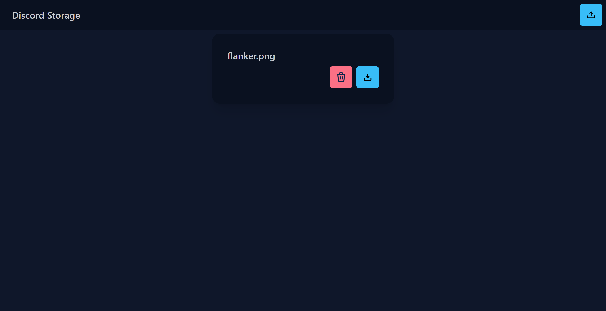

# Discord Storage
A webapp that allows you to use discord as cloud storage

> [!CAUTION]
> Use At Your Own Risk: Using Discord for storage is against the platform's TOS. This is made purely for educational purposes.

## Instructions
1. Create a new application at https://discord.com/developers
2. Enable all intents under the bot section.
3. Add the bot to a server with adminstrator perms.
4. Download and extract pocketbase from https://pocketbase.io/ to your working directory.
5. Run pocketbase with `./pocketbase serve`.
6. Navigate to http://127.0.0.1:8090/_/
7. Create a new collection called `files`, with the following fields:

|key|dataType|
|---|---|
|`fileName`| text|
|`randName`| text|
|`noOfFiles`| number|
|`ids`| json|

8. Clone this repo.
9. Rename the `.env.template` file in the `backend` directory to `.env` and fill all the fields in the file.
10. Run `npm i` in both `frontend` and `backend` directories.
11. Run `node commands.js` in the `backend` directory.
12. Run `npm start` in the `backend` directory.
13. Run `npm run dev` in the `frontend` directory.
14. Navigate to http://localhost:5173 on your browser.
